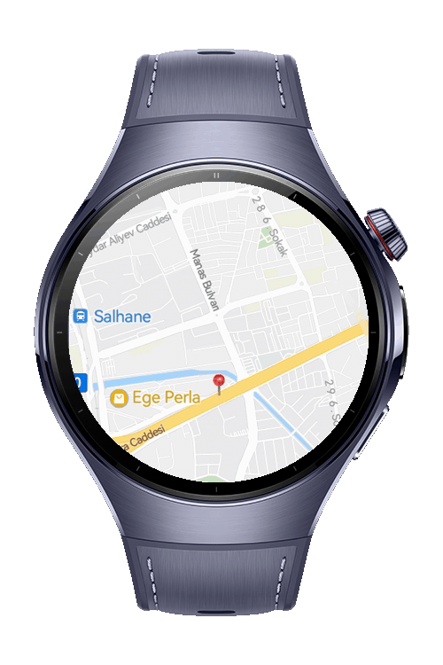

> **Note:** To access all shared projects, get information about environment setup, and view other guides, please visit [Explore-In-HMOS-Wearable Index](https://github.com/Explore-In-HMOS-Wearable/hmos-index).

# How to Display a Predefined Place on a Map (HarmonyOS NEXT)
This codelab showcases how to **display a predefined place detail on a map** using HarmonyOS NEXT APIs.  
It focuses solely on a basic use case without any search, navigation, or dynamic data fetching.

# Use Cases
- Show a default location on the map.
- Display a marker with a title at the specified location.

# Preview
<div>
  
</div>

# Technology
## Stack
- **Languages**: ArkTS, Typescript
- **Frameworks**: HarmonyOS SDK 5.1.0(18)
- **Tools**: DevEco Studio Version 5.1.0.828
- **Libraries**:
  - `@kit.ArkUI`
  - `@kit.AbilityKit`
  - `@kit.ArkData`
  - `@kit.PerformanceAnalysisKit`'
  - `@kit.MapKit`

## Required Permissions
- `ohos.permission.INTERNET`

# Directory Structure
```
entry/src/main/ets/
|---common
|   |---Place.ets                  // Place and LatLng model
|---pages
|   |---Index.ets                  // Main page to show map and marker
|---module.json5                   // Permissions and meta config
```

# Constraints and Restrictions
## Supported Device
* Huawei Watch 5

# License
**How to Display a Predefined Place on a Map (HarmonyOS NEXT)** is distributed under the terms of the MIT License
See the [license](./LICENSE) for more information.

